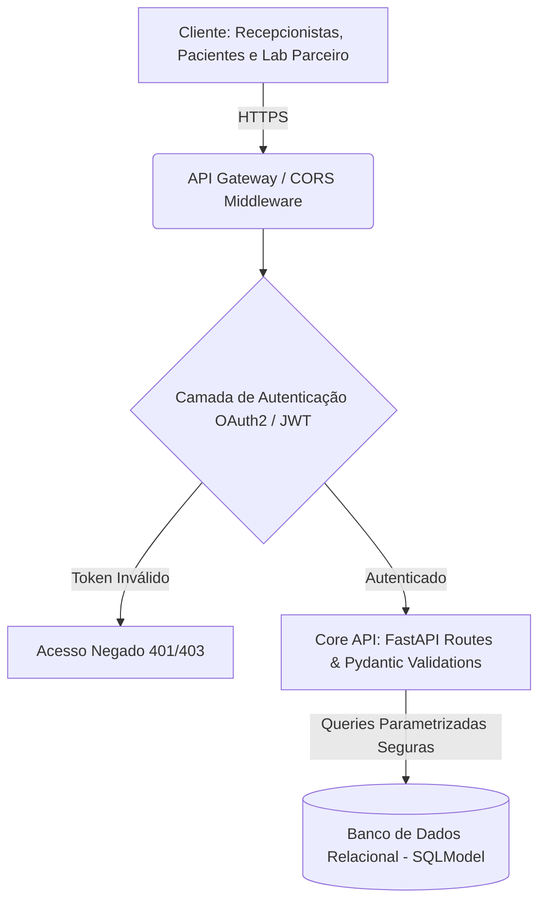

# Relatório Técnico DevSecOps - API Agendamento Médico (Capstone AT)

## 1. Fundamentação e Arquitetura (Ex 3, 5 e 6)

### Tríade CIA e Trust Boundaries
- **Confidencialidade**: Risco regulatório altíssimo (LGPD/Saúde). Mitigada com TLS, forte autenticação JWT e prevenção de BOLA.
- **Integridade**: Garantida por queries parametrizadas SQLModel e Pydantic rejeitando atributos extras.
- **Disponibilidade**: Protegida contra DDoS/Brute Force via Rate Limiting na rota de login (`slowapi`).

### DFD Básico (Fronteiras de Segurança)

### Modelo de Autorização Escolhido
Foi adotada uma combinação de **RBAC e autorização por recurso (ownership)**. O RBAC é utilizado para diferenciar perfis macro de acesso, como `admin`, `medico`, `paciente` e `lab` (este último distinguido via escopos M2M). Já a autorização por recurso valida o *ownership*, garantindo que médicos e pacientes acessem estritamente os prontuários aos quais pertencem (mitigando vulnerabilidades IDOR/BOLA). 

Embora o modelo ABAC (*Attribute-Based Access Control*) permita políticas granulares avançadas (ex: restringir acesso por endereço IP ou horário de expediente), ele adicionaria uma complexidade arquitetural desnecessária para a fase atual do projeto. A junção RBAC + Ownership atende aos requisitos da LGPD com alta rastreabilidade e simplicidade de implementação.

## 2. Modelagem de Ameaças (STRIDE e Misuse Cases - Ex 4)
- **Misuse Case**: "Paciente autenticado tenta manipular o ID da consulta na URL (Ex: `GET /consultas/55`) para acessar laudos médicos de terceiros."
- **Spoofing**: Mitigado por OAuth2 + JWT com chaves assinadas.
- **Tampering**: Assinatura JWT impede a adulteração da role e de IDs dentro do payload.
- **Repudiation**: O sistema atualmente carece de logs transacionais precisos (Risco residual).
- **Information Disclosure**: Prevenido pelo uso estrito de *Response Models* do Pydantic limitando dados trafegados.
- **Denial of Service**: Mitigado por limite de `5 requests/minuto` na porta de autenticação (`/auth/login`).
- **Elevation of Privilege**: Travado via verificação explícita do ID do usuário contra a base.

## 3. Integração de Segurança e SDLC (Ex 12)

Para blindar o pipeline automatizado, a seguinte organização de testes de segurança e ferramentas foi aplicada ao longo do Ciclo de Vida de Desenvolvimento de Software (SDLC):

| Ferramenta | Tipo | Momento no SDLC | Função |
| :--- | :--- | :--- | :--- |
| **Bandit** | SAST | CI / Build | Analisa estaticamente o código Python em busca de vulnerabilidades. |
| **Safety** | SCA | CI / Build | Varre os pacotes do `requirements.txt` em busca de dependências com vulnerabilidades CVE conhecidas. |
| **pytest** | Security Testing | CI / Test | Executa testes unitários de segurança cobrindo BOLA, Rate Limiting, XSS, tokens e payloads extras. |
| **OWASP ZAP** | DAST | CI / Test | Interage dinamicamente com a API em execução (`localhost:8000`) identificando falhas de header HTTP e CORS. |
| **IAST** (Não aplicado) | IAST | Test / Runtime | *O IAST não foi implementado neste MVP para não engessar o setup do Actions, visto que o DAST cumpre a função imediata de scanner blackbox nesta fase.* |

### O Security Gate (Critério de Bloqueio)
O pipeline (`devsecops.yml`) possui uma etapa explícita definida como `Security Gate`. O critério estipulado determina que **findings de severidade ALTA (HIGH) detectados pelo Bandit (SAST) bloqueiam imediatamente o pipeline**. O script Python embutido no GitHub Actions lê o JSON do Bandit, acusa um código de saída 1 (erro) e barra o Pull Request caso a condição seja atingida. A ferramenta Safety (SCA) foi configurada para rodar de forma não-bloqueante (`|| true`) nesta esteira inicial para fins de auditoria contínua, garantindo que o bloqueio duro (*hard gate*) fique concentrado no código-fonte proprietário.

## 4. Auditoria Final, Correções e Tabela CVSS (Ex 8, 9 e 13)

Abaixo, a priorização baseada em critérios CVSS (conforme rubrica) aplicada às falhas identificadas no threat model e testes exploratórios:

| Vulnerabilidade Encontrada | Categoria OWASP | CVSS v3.1 Score | Impacto de Negócio | Status / Correção |
| :--- | :--- | :--- | :--- | :--- |
| Acesso indevido a consultas (BOLA/IDOR) | Broken Object Level Authorization | 8.5 (High) | Acesso a laudos de terceiros | Corrigido em `routes/consultas.py` validando propriedade do paciente e médico. |
| Stored XSS em campo de observações — corrigido por output encoding/autoescape do Jinja2. | Injection | 6.1 (Medium) | Roubo de sessão da recepção | Corrigido via *auto-escape* em `templates/agenda.html`. |
| Mass Assignment no Cadastro | Security Misconfiguration | 5.3 (Medium) | Modificação de propriedades não esperadas | Corrigido configurando `extra='forbid'` no modelo Pydantic. |
| Rate Limiting Inexistente | Identification/Auth Failures | 7.5 (High) | Indisponibilidade e Força Bruta | Corrigido via `slowapi` na rota de `/login`. |

### ZAP Scan Passivo e OpenAPI
- **Finding ZAP**: `Cross-Domain Misconfiguration`. Corrigido substituindo wildcard `*` pela Allowlist oficial da clínica e do lab parceiro no CORS.
- **Finding ZAP**: `Missing Anti-clickjacking Header`. Corrigido através de *middleware* HTTP injetando `X-Frame-Options: DENY`.
- **Finding OpenAPI**: O Swagger (`/docs`) exibia o formulário OAuth2 de forma muito genérica, expondo a superfície do rate limit. Faltava documentar explícita e claramente os códigos `422` e `429`.

### Riscos Residuais (Justificativa de Deploy)
A rotação das chaves secretas do JWT ainda está no `.env` sem um KMS (Key Management Service) provisionado na nuvem. O ZAP reporta warnings informativos devidos à falta de controles transacionais pesados de Anti-CSRF (mitigado naturalmente pelo uso estrito de Bearer tokens em API Stateless). Tendo em vista as correções completas da base e a aprovação estrita no pipeline, o deploy **é aceitável para o ambiente V1/Homologação**, devendo as integrações de KMS entrarem como prioridade máxima no backlog de Produção da clínica.

## 5. Mapeamento de frameworks

| Framework | Referência | Controle implementado |
| :--- | :--- | :--- |
| OWASP API Security | API1 – BOLA | Ownership em `/consultas/{id}` |
| OWASP | XSS/Injection | Pydantic + Jinja2 autoescape |
| OWASP | Security Misconfiguration | CORS allowlist + Security Headers |
| NIST SSDF | PW.5 | Testes automatizados de segurança |
| NIST SSDF | PW.7 | SAST/SCA/DAST no CI/CD |
| MITRE ATT&CK | T1078 | Autenticação e validação de tokens |
| MITRE ATT&CK | T1190 | DAST/ZAP sobre aplicação exposta |
